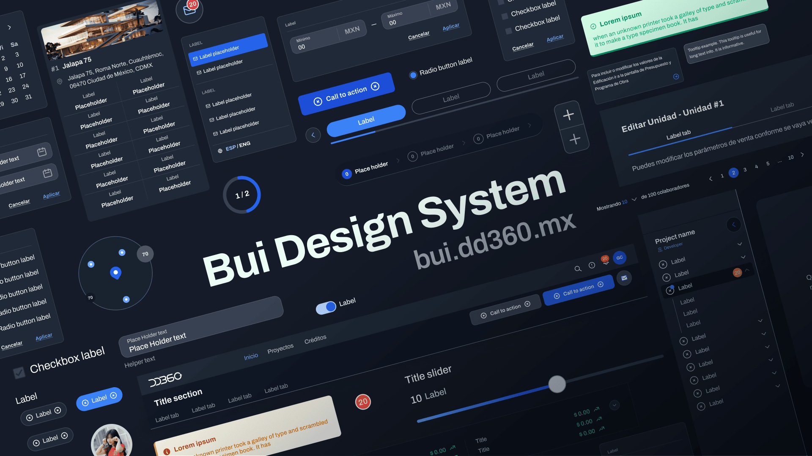

<div align="center">

<hr />
<br/>

A React ecosystem library for building back-office platforms like [DD360](https://dd360.mx/). <br/>
It's library created by developers for developers 
<br/>

<p>
  <a href="https://bui.dd360.mx/" rel="noopener" target="_blank"></a>
</p>

<h3>
  <a rel="noopener" target="_blank" href="https://bui.dd360.mx/docs/get-started/getting-started">Docs</a> &bull;
  <a rel="noopener" target="_blank" href="https://bui.dd360.mx">Website</a>
</h3>

</div>

## 📲 Installation

```bash
npm install dd360-ds
```

or

```bash
yarn add dd360-ds
```

## 💅 Customize theme

If you want to use a provider to configure the library's theme, you can do so using the ThemeProvider provided by dd360-ds. This will allow you to set your own settings for the theme.

To use the ThemeProvider, you must import it as follows:

```tsx
import { createTheme, ThemeProvider } from "dd360-ds/theme";
```

You can then create your own theme configuration using the createTheme function, which accepts an object with different properties to customize the theme. For example, you can define the primary and secondary colors as shown below:

```tsx
const theme = createTheme({
  palette: {
    primary: {
      main: "purple"
    },
    secondary: {
      main: "#FFC107"
    }
  }
});
```

After creating your theme configuration, you can use the ThemeProvider to wrap your React app. This can be done as follows:

```tsx
ReactDOM.createRoot(document.getElementById("root")).render(
  <StrictMode>
    <ThemeProvider theme={theme}>
      <App />
    </ThemeProvider>
  </StrictMode>
);
```

Within the ThemeProvider, you can use the components provided by dd360-ds and the corresponding styles will be applied based on your theme settings.

Remember that to use the ThemeProvider, you must import both the createTheme component and the ThemeProvider component from dd360-ds/theme.

## 💡 Usage

After Installation, you will have to make some extra configurations for everything to work normally.

Import stylesheets into the `App.js` or `App.tsx`

```js
import 'dd360-ds/dd360.css'
```

⚠️ ***Warning: If you want to combine it with other styles, be sure to import our css as the last one.***


How to import components?

```jsx
import { Button } from 'dd360-ds'
```

## 🔫 Components

This is the most fun part. Below we will explain the use of the components we are currently developing.


